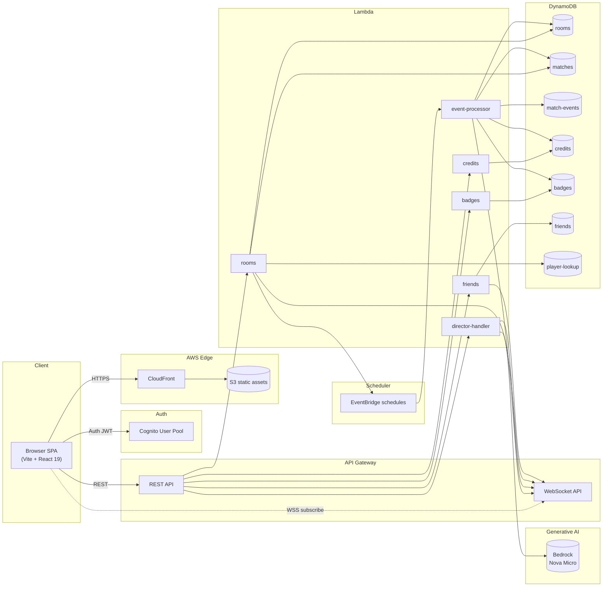
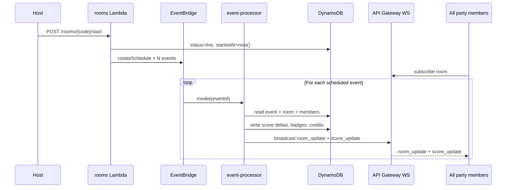
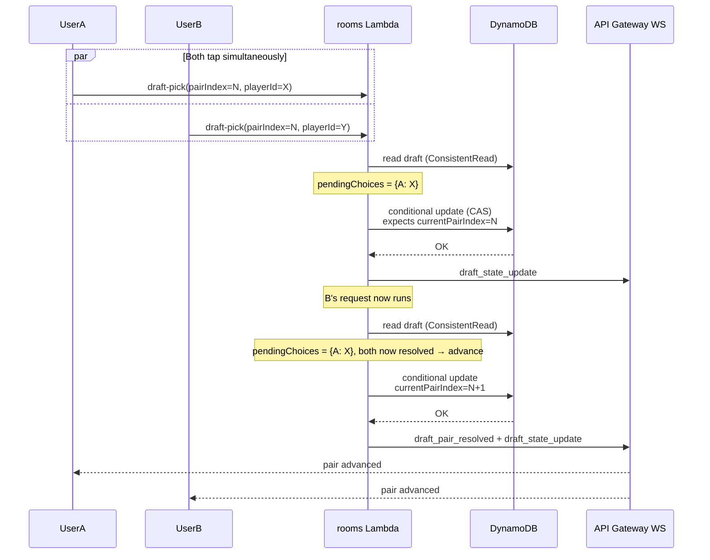

# Architecture — Brezn

The app is a React SPA in front of an event-driven AWS backend. Real-time
state changes flow through API Gateway WebSocket connections; durable state
lives in DynamoDB; the AI agent runs on Bedrock Nova Micro behind a Lambda
that the frontend can mode-multiplex (per-event ticks vs one-shot captain
suggestions).

---

## Service map



---

## Data flows

### 1. Live match event ingest + fanout

The match is a parsed XML replay loaded into `claudiu-match-events`. The
host's `Start Match` action stamps a `startedAt` on the room and writes
EventBridge schedules — one per event — at `startedAt + (eventTimeSec /
speedMultiplier × 1000 ms)`.



Once all events have fired, `event-processor._end_rooms` flips the match
status to `complete`, awards end-of-match credits + badges, and broadcasts
`match_ended`.

### 2. Party invite acceptance — instant navigation

```mermaid
sequenceDiagram
  participant Inviter
  participant Friends as friends Lambda
  participant WS as API Gateway WS
  participant Invitee as Invitee SPA
  participant LobbyPage as Lobby

  Inviter->>Friends: POST /friends/{id}/invite
  Friends->>WS: push to user#{inviteeId}
  WS-->>Invitee: room_invite {roomCode, matchId, inviter}
  Invitee->>Invitee: handleAccept fires
  Note over Invitee: setPending(null); navigate(/lobby/X, { state: { initialRoom } })
  Invitee->>LobbyPage: mount with initialRoom stub<br/>(both members + hostUserId)
  par Background
    Invitee->>Friends: POST /rooms/{code}/join
    Friends->>WS: broadcast room_update
    WS-->>Invitee: room_update (authoritative)
  end
```

The stub `initialRoom` (passes 35–36) means the lobby renders fully-populated
on the first frame; the WS `room_update` just confirms what's already on
screen.

### 3. Coordinated draft pick — CAS + soft-ack stale race



If a third client raced and tried to submit `pairIndex=N` after
`currentPairIndex` had already advanced, the backend returns
`{ok: True, stale: True, currentPairIndex: cur_idx}` instead of raising
(pass 37). Frontend clears its optimistic `chosen` lock; the next WS
`room_update` syncs the user's UI.

### 4. Halftime — match-aware quiz generation

```mermaid
sequenceDiagram
  participant EP as event-processor
  participant DH as director-handler
  participant BR as Bedrock Nova Micro
  participant WS as API Gateway WS
  participant Client

  EP->>EP: halftime event fires
  EP->>WS: broadcast match_event(halftime)<br/>+ minigame_start(HALFTIME_QUIZ, fallback)
  Client->>DH: POST /rooms/{code}/director-tick<br/>{snapshot, playerDirectory, firstHalfEvents}
  DH->>BR: Converse(SYSTEM_PROMPT + snapshot)
  BR-->>DH: JSON {action: start_minigame, gameType: HALFTIME_QUIZ, config.questions}
  DH->>DH: validate schema, no-duplicate options, confidence ≥ 0.7,<br/>player-bio names in playerDirectory,<br/>at least one type=match-event
  alt All checks pass
    DH->>WS: minigame_start(HALFTIME_QUIZ, AI questions)
    WS-->>Client: overrides the static fallback
  else
    Note over DH: drop the AI questions; static fallback already broadcast
  end
```

Hallucination guards (defined in `prompts.py` + `service.py`):

1. **Schema gate** — each question must have 4 distinct non-empty choices, a `correctIdx` in `[0, 4)`, a `category`, a `type` ∈ {`match-event`, `player-bio`}, and a `confidence` ∈ `[0, 1]`.
2. **Confidence filter** — drop any question with `confidence < 0.7`.
3. **Name-grounding** — `player-bio` questions must reference a name from `playerDirectory` (the authoritative {playerName → teamName} map built from the actual rosters of THIS match).
4. **Required match-event** — at least one of the 3 surviving questions must be type `match-event` (grounded in confirmed first-half events), else drop the whole quiz.
5. **Banned phrases** — the prompt explicitly forbids "today", "currently", "this season", trophy counts, current jersey numbers, etc. — anything that drifts over time.

If validation drops everything, the frontend's `pickFallbackQuestions(3)` static pool fires instead. Users always see a coherent quiz; they never see a wrong answer.

---

## Why Bedrock Nova Micro

- Direct invocable in `eu-central-1` (no Marketplace subscription).
- ~8× cheaper than Anthropic models on this workload (~250-token outputs, 30 ticks per match cap).
- The Converse API is model-agnostic — we can swap to a stronger model via env var (`BEDROCK_MODEL_ID`) if the price-quality tradeoff shifts.

---

## Infra-as-code

Every backend stack is a CloudFormation template under `infra/`:

```
infra/
  cicd/           — OIDC IAM roles for GitHub Actions
  compute/        — Lambda stacks (rooms, credits, badges, friends, director, event-processor, matches)
  data/           — DynamoDB tables
  hosting/        — CloudFront + S3 frontend
  shared/         — Cognito, base IAM, log groups
```

Each has a matching `.github/workflows/deploy-*.yml` that triggers on push
to `main` touching the template, and deploys via the OIDC role —
no long-lived secrets.
